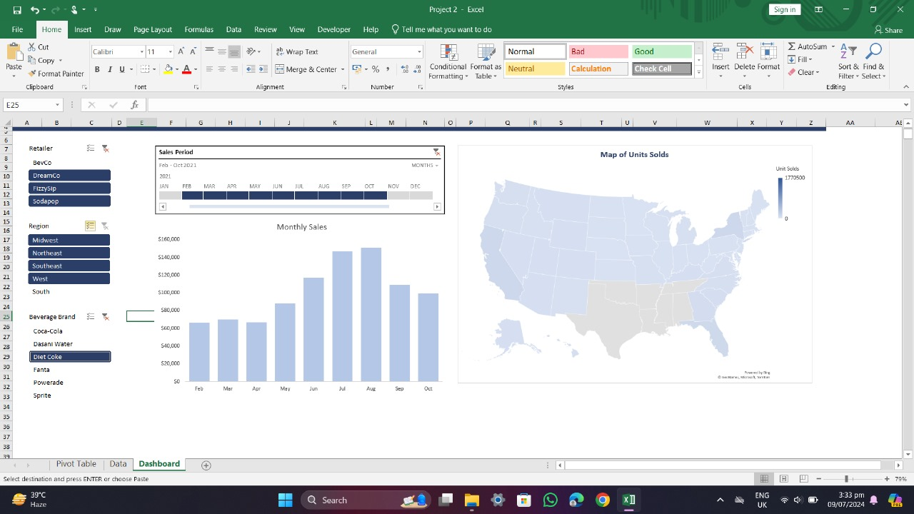

# 🥤 Coca-Cola Sales Dashboard

A visually engaging and interactive sales dashboard built in Excel to analyze and monitor Coca-Cola's sales performance. This project leverages Excel's powerful visualization features along with macros to enhance interactivity.

---

## 📁 Project Files

- 📊 **CocaCola_Sales_Data.csv** – Raw sales data used for analysis.
- 📈 **CocaCola_Sales_Dashboard.xlsm** – Macro-enabled Excel workbook with dynamic dashboards.
- 🖼️ **CocaCola_Sales_Dashboard.jpg** – Snapshot of the final dashboard.

---

## ✨ Features

- Dynamic and interactive dashboard built with Excel.
- Macros to automate calculations and enhance user experience.
- Clean and professional data visuals (charts, KPIs, filters).
- Easy filtering by **Region**, **Product**, and **Time Period**.

---

## 🚀 Getting Started

1. Download or clone this repository.
2. Open `CocaCola_Sales_Dashboard.xlsm` in **Microsoft Excel**.
3. Make sure to **enable macros** to allow full functionality.
4. Explore and analyze the dashboard using built-in filters and visuals.

---

## 📸 Preview

Here’s a quick look at what the dashboard delivers:

---

## 👩‍💻 Author

**Kadiri Vaishnavi**  
📧 Email: ammuk.v259@gmail.com  
🔗 GitHub: [@Kadiri-Vaishnavi](https://github.com/Kadiri-Vaishnavi)

---

